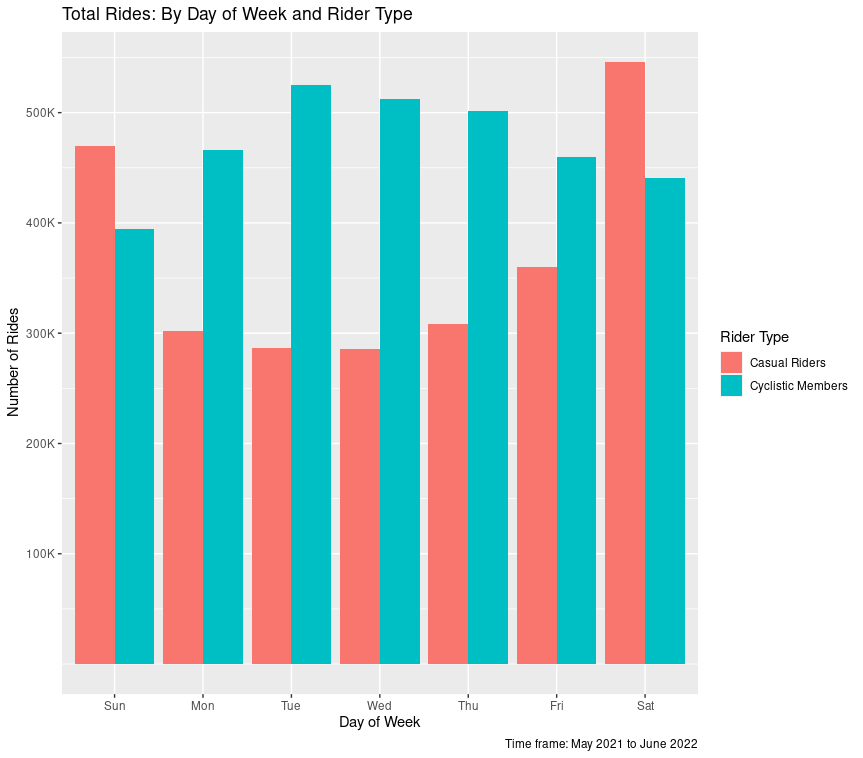
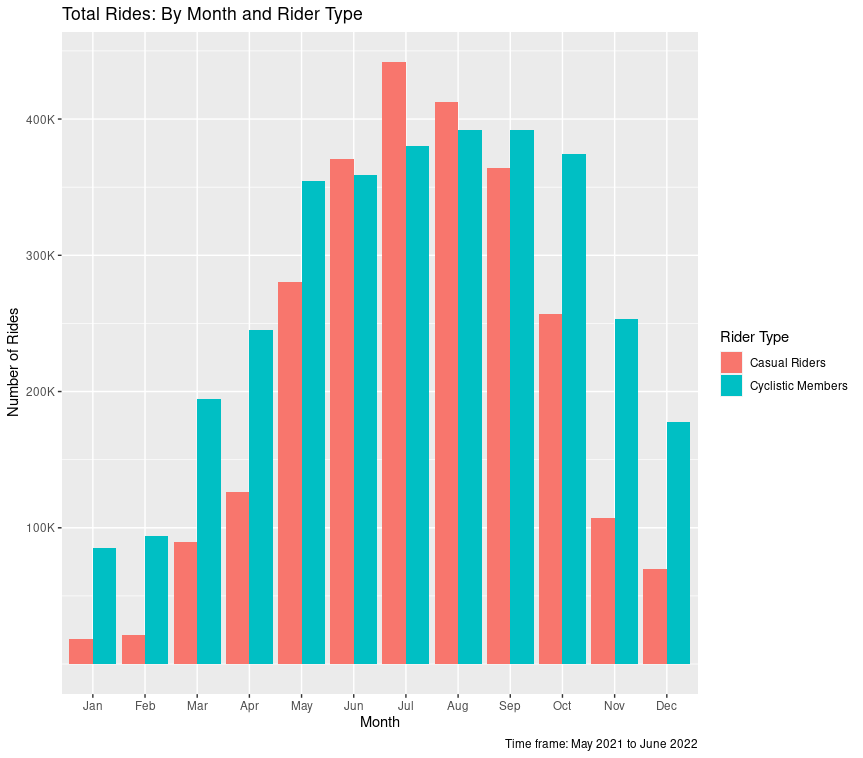

```{r setup, include=FALSE}
knitr::opts_chunk$set(echo = TRUE)
```

This case study is the capstone project for the Google Data Analytics Professional Certificate. The following analysis was completed for Course 8 - Case Study 1. 

# Overview
### About Cyclistic
Cyclistic is a bike-share program founded in 2016 in Chicago, Illinois. Today, it operates more than 5,800 bicycles and 600 docking stations. With a variety of regular and assistive bike types (recumbents, hand-trikes, cargo bikes) and flexible pricing plans, Cyclistic has garnered broad appeal across consumer segments.

### Scenario
The director of marketing at Cyclistic, Lily Moreno, believes that the future success of the company depends on maximizing the number of annual memberships. To that end, our team wants to understand how casual riders and annual members use Cyclistic bikes differently. From there, Cyclistic will design a new marketing strategy to convert more casual riders into annual members.

### Stakeholders
**Lily Moreno, Director of Marketing**  
Develops campaigns and initiatives to promote the bike-share program.

**Cyclistic Marketing Analytics Team**  
Collects, analyzes, and reports data to guide Cyclistic's marketing strategy.

**Executive Team**  
Decides whether to approve the recommended marketing program.

### Data Sources
This analysis uses the [dataset](https://divvy-tripdata.s3.amazonaws.com/index.html) originally published in "'Sophisticated, Clear, and Polished': Divvy and Data Visualization (Case Study)" by Kevin Hartman. These data are used in this analysis under the terms of Motivate International's [Data License Agreement](https://ride.divvybikes.com/data-license-agreement).

# Scope of Work
### Business Task
The team aims to answer three main guiding questions for the Cyclistic marketing team:

* How do annual members and casual riders user Cyclistic bikes differently?
* Why would casual riders buy Cyclistic annual memberships?
* How can Cyclistic use digital media to influence casual riders to become members?

### Deliverables
* A clear statement of the business task
* A description of all data sources used
* Documentation of any cleaning or manipulation of data
* A summary of the analysis
* Supporting visualizations and key findings
* Top three recommendations based on analysis

# Deliverables
## Define the Business Task
### The Current Problem
Cyclistic's marketing strategy has so far been focused on building awareness and appealing to broad consumer segments. This was accomplished with flexible pricing plans (single-ride passes, full-day passes, and annual memberships). However, Cyclistic is no longer able to rely solely on this strategy as it reaches market saturation.

Based on findings from the finance team, marketing director Moreno believes that future revenue growth is best captured by maximizing the number of annual members. In addition, since casual riders are already aware of the Cyclistic program, Moreno believes there is a high chance of converting casual riders into members, given the right marketing strategy.

The marketing analytics team's primary goal, therefore, is to determine how annual and casual riders differ in their usage behavior, why casual riders would want to buy annual memberships, and how Cyclistic can leverage digital media to influence casual riders to become members.

### Stakeholder Expectations
**Executive Team**  
The executive team will expect to receive a high-level takeaway of the main data analysis insights, along with how these insights drive Cyclistic's future marketing strategy.

**Lily Moreno, Director of Marketing**  
The director of marketing will expect evidence to support her theory and proposed marketing strategy.

## Data Cleaning and Manipulation
### Setting up the R environment
For this analysis, we will be using R in RStudio. This is due to the size of the dataset, which contains about 5.86 million records before data cleaning.

Set up and load the tidyverse:

```{r, eval = FALSE}
install.packages("tidyverse")

library(tidyverse)
```

To assist in data cleaning, install here, skimr, lubridate, and janitor, and load them into the environment:

```{r, eval = FALSE}
install.packages("here")
install.packages("skimr")
install.packages("lubridate")
install.packages("janitor")

library(here)
library(skimr)
library(lubridate)
library(janitor)
```

### Importing raw dataset
The scope of our analysis covers the last 12 months of available trip data.

We first import the data CSVs as data frames into RStudio:

```{r, eval = FALSE}
df_202106 <- read_csv("datasets/202106-divvy-tripdata.csv")
df_202107 <- read_csv("datasets/202107-divvy-tripdata.csv")
df_202108 <- read_csv("datasets/202108-divvy-tripdata.csv")
df_202109 <- read_csv("datasets/202109-divvy-tripdata.csv")
df_202110 <- read_csv("datasets/202110-divvy-tripdata.csv")
df_202111 <- read_csv("datasets/202111-divvy-tripdata.csv")
df_202112 <- read_csv("datasets/202112-divvy-tripdata.csv")
df_202201 <- read_csv("datasets/202201-divvy-tripdata.csv")
df_202202 <- read_csv("datasets/202202-divvy-tripdata.csv")
df_202203 <- read_csv("datasets/202203-divvy-tripdata.csv")
df_202204 <- read_csv("datasets/202204-divvy-tripdata.csv")
df_202205 <- read_csv("datasets/202205-divvy-tripdata.csv")
```

### Inspecting raw data
To gain a better general understanding of the data for the next step (assessing data quality), we can call skim_without_charts() on one of our datasets for a brief summary:

```{r, eval = FALSE}
skim_without_charts(df_202106)
```

```
── Data Summary ────────────────────────
                           Values   
Name                       df_202106
Number of rows             729595   
Number of columns          13       
_______________________             
Column type frequency:              
  character                7        
  numeric                  4        
  POSIXct                  2        
________________________            
Group variables            None     

── Variable type: character ────────────────────────────────────────────────────────────────────────────────────────────────────
  skim_variable      n_missing complete_rate min max empty n_unique whitespace
1 ride_id                    0         1      16  16     0   729595          0
2 rideable_type              0         1      11  13     0        3          0
3 start_station_name     80093         0.890  10  53     0      689          0
4 start_station_id       80093         0.890   3  35     0      689          0
5 end_station_name       86387         0.882  10  53     0      690          0
6 end_station_id         86387         0.882   3  35     0      690          0
7 member_casual              0         1       6   6     0        2          0

── Variable type: numeric ──────────────────────────────────────────────────────────────────────────────────────────────────────
  skim_variable n_missing complete_rate  mean     sd    p0   p25   p50   p75  p100
1 start_lat             0         1      41.9 0.0425  41.6  41.9  41.9  41.9  42.1
2 start_lng             0         1     -87.6 0.0260 -87.8 -87.7 -87.6 -87.6 -87.5
3 end_lat             717         0.999  41.9 0.0427  41.5  41.9  41.9  41.9  42.1
4 end_lng             717         0.999 -87.6 0.0262 -87.9 -87.7 -87.6 -87.6 -87.5

── Variable type: POSIXct ──────────────────────────────────────────────────────────────────────────────────────────────────────
  skim_variable n_missing complete_rate min                 max                 median              n_unique
1 started_at            0             1 2021-06-01 00:00:38 2021-06-30 23:59:59 2021-06-14 19:46:47   589805
2 ended_at              0             1 2021-06-01 00:06:22 2021-07-13 22:51:35 2021-06-14 20:13:55   589069
```

### Assessing Data Quality
Having taken a high-level look at the summary metrics for our dataset, we can start making some assessments about the quality and reliability of the data, which will be used to inform further data cleaning actions.

To assess data quality, we use the ROCCC (reliable-original-comprehensive-current-cited) model.

**Reliability**  
As seen in the data summary, over 10% of rides have missing values. Upon inspecting the data frame in RStudio, we also found a significant number of rides over 24 hours, as well as rides with end date/time before start date/time. Station IDs formats were found to have changed over time, possibly indicative of changes in data collection techniques.

**Originality**  
The data are sourced directly from Motivate International, a major bicycle sharing provider in North America. As they are also the operators of Cyclistic, this data is deemed original.

**Comprehensiveness**  
The data contains bike type, rider type, geographic information, as well as dates/times of trips on the system. As our analyses focus on differentiating casual and member ride behavior, this dataset meets our requirements for comprehensiveness.

**Current**  
The data covers all rides completed between June 2021 and May 2022.

**Cited**  
The dataset is maintained by Motivate International and vetted for use as a sample dataset in case studies. The data was last updated in May 2022.

*We are satisfied that this dataset meets our requirements for high-quality data, with the aforementioned caveats in its reliability to be resolved during data cleaning.*

### Merging Dataset
For easier cleaning, manipulation, and further analysis, we will merge our 12 data frames into 1.

```{r, eval = FALSE}
df_bike <- rbind(df_202106, df_202107, df_202108, df_202109, df_202110,
                 df_202111, df_202112, df_202201, df_202202, df_202203,
                 df_202204, df_202205)
```

We will also make a backup of the merged data frame, as we want to keep a copy of the raw dataset pre-cleaning.

```{r, eval = FALSE}
df_bike_backup <- df_bike
```

### Aggregating Columns
To simplify further analysis and add metrics by which to evaluate rider behavior, we will create two new columns representing ride length (time in minutes), and the day of the week the ride occurred.

```{r, eval = FALSE}
df_bike$ride_length <- as.numeric(df_bike$ended_at - df_bike$started_at, units="mins")
df_bike$day_of_week <- wday(df_bike$started_at)
```

We also want to aggregate monthly data for later analysis to intuit possible customer behavior changes by month (or season).

```{r, eval = FALSE}
df_bike$month_of_year <- month(df_bike$started_at)
```

Lastly we want the day of week and month in human-readable format for our later visualizations:

```{r, eval = FALSE}
df_bike <- df_bike %>% 
  mutate(weekday_name = wday(day_of_week, label = TRUE)) %>% 
  mutate(month_name = month(month_of_year, label = TRUE))
```

### Cleaning Dataset
We will first check for any duplicate records:

```{r, eval = FALSE}
df_bike <- distinct(df_bike)
```

Then, we remove columns that are not relevant to the analysis, namely ride ID, and start/end station information (we will rely on coordinates should we wish to analyze customer behavior geographically).

```{r, eval = FALSE}
df_bike <- select(df_bike, -c(ride_id, start_station_name, start_station_id, end_station_name, end_station_id))
```

As mentioned earlier, some ride records have either negative or extremely long ride lengths. Here, we will remove records with negative ride lengths and ride lengths of over 24 hours.

```{r, eval = FALSE}
df_bike <- df_bike %>% 
  filter(ride_length < 1440 & ride_length > 0)
```

## Analysis

### Summary Statistics
We'll take a look at summaries of the aggregated and transformed data frame to ensure we have the columns we need and have removed outliers that may skew further statistical analyses.

```{r, eval = FALSE}
skim_without_charts(df_bike)
```
```
── Data Summary ────────────────────────
                           Values 
Name                       df_bike
Number of rows             5855724
Number of columns          11     
_______________________           
Column type frequency:            
  character                2      
  numeric                  7      
  POSIXct                  2      
________________________          
Group variables            None   

── Variable type: character ─────────────────────────────────────────────────────────────────────────────────
  skim_variable n_missing complete_rate min max empty n_unique whitespace
1 rideable_type         0             1  11  13     0        3          0
2 member_casual         0             1   6   6     0        2          0

── Variable type: numeric ───────────────────────────────────────────────────────────────────────────────────
  skim_variable n_missing complete_rate   mean      sd       p0    p25   p50   p75   p100
1 start_lat             0          1     41.9   0.0470  41.6     41.9   41.9  41.9   45.6
2 start_lng             0          1    -87.6   0.0305 -87.8    -87.7  -87.6 -87.6  -73.8
3 end_lat            1605          1.00  41.9   0.0471  41.4     41.9   41.9  41.9   42.2
4 end_lng            1605          1.00 -87.6   0.0301 -89.0    -87.7  -87.6 -87.6  -87.5
5 ride_length           0          1     18.3  34.0      0.0167   6.35  11.3  20.6 1440. 
6 day_of_week           0          1      4.08  2.05     1        2      4     6      7  
7 month_of_year         0          1      7.25  2.58     1        5      7     9     12  

── Variable type: POSIXct ───────────────────────────────────────────────────────────────────────────────────
  skim_variable n_missing complete_rate min                 max                 median              n_unique
1 started_at            0             1 2021-06-01 00:00:38 2022-05-31 23:59:56 2021-09-23 17:31:28  4893239
2 ended_at              0             1 2021-06-01 00:06:22 2022-06-01 16:45:51 2021-09-23 17:47:12  4889693
```

As we can see, there are no longer any negative ride lengths, and we have our added ride_length, day_of_week, and month_of_year columns, all of which have valid ranges of values.

### Ride Length: Member vs. Casual
Drawing upon our calculated ride length column, we will compare mean and median ride lengths of members and casual riders.

```{r, eval = FALSE}
aggregate(df_bike$ride_length ~ df_bike$member_casual, FUN = mean)
aggregate(df_bike$ride_length ~ df_bike$member_casual, FUN = median)
```

**Mean**
```
  df_bike$member_casual df_bike$ride_length
1                casual            25.49791
2                member            12.80492
```
**Median**
```
  df_bike$member_casual df_bike$ride_length
1                casual           15.250000
2                member            9.116667
```

We can see that, on average, **casual riders take longer rides than members**. 

### Most Popular Day of Week for Rides
We take a look at the day of the week when members and casual riders take the most trips (the mode).

Since neither R nor the packages we use in this analysis have a built-in function for determining the statistical mode of a dataset, we will define one ourselves with the name "Mode" (code by Ken Williams on [Stack Overflow](https://stackoverflow.com/questions/2547402/how-to-find-the-statistical-mode)):

```{r, eval = FALSE}
Mode <- function(x) {
  ux <- unique(x)
  ux <- [which.max(tabulate(match(x, ux)]
}
```

We can then find the mode for day_of_week grouped by member/casual rider:

```{r, eval = FALSE}
aggregate(df_bike$day_of_week ~ df_bike$member_casual, FUN = Mode)
```

```
  df_bike$member_casual df_bike$day_of_week
1                casual                   7
2                member                   3
```

For casual riders, the most popular day of the week for rides is **Sunday**.  
For Cyclistic members, the most popular day is **Wednesday**.

### Type of Bike: Member vs. Casual
We also want to see whether there are any significant differences in bike preference between members and casual riders:

```{r, eval = FALSE}
df_bike %>% 
  group_by(member_casual, rideable_type) %>% 
  summarize(num_of_rides = n())
```

```
  member_casual rideable_type   num_of_rides
  <chr>         <chr>           <int>
1 casual        classic_bike  1233949
2 casual        docked_bike    273027
3 casual        electric_bike 1048653
4 member        classic_bike  1980537
5 member        electric_bike 1319558
```

Overall, **classic bikes are more popular than electric bikes for both customer types**. However, correlation does not equal causation, and these results may be influenced by the availability/proportion of each respective bike type in the Cyclistic network.

## Visualizations and Key Findings
### Total Rides: By Day of Week and Rider Type
Following our previous findings of the most popular days for riding by member/casual rider, we'll dig deeper and look at each day of the week with a chart:

```{r, eval=FALSE}
df_bike %>% 
  group_by(member_casual, weekday_name) %>% 
  summarize(num_of_rides = n()) %>% 
  ggplot(aes(x = weekday_name, y = num_of_rides, fill = member_casual)) +
  geom_col(position = "dodge") +
  labs(x = "Day of Week", y = "Number of Rides", title = "Total Rides: By Day of Week and Rider Type", fill = "Rider Type", caption = "Time frame: May 2021 to June 2022") + 
  scale_y_continuous(breaks = c(100000, 200000, 300000, 400000, 500000), labels = c("100K", "200K", "300K", "400K", "500K"))
```

  

From this chart, we can see that casual riders tend to use Cyclistic on weekends, while members ride more on weekdays. This confirms our previous findings above, and suggests that casual riders choose Cyclistic for their mobility needs in Chicago during weekend activities, while members use Cyclistic more for commuting and work trips.

### Total Rides: By Month and Rider Type
We also want to see how total rides break down by month:

```{r, eval = FALSE}
df_bike %>% 
  group_by(member_casual, month_name) %>% 
  summarize(num_of_rides = n()) %>% 
  ggplot(aes(x = month_name, y = num_of_rides, fill = member_casual)) +
  geom_col(position = "dodge") +
  labs(x = "Month", y = "Number of Rides", title = "Total Rides: By Month and Rider Type", fill = "Rider Type", caption = "Time frame: May 2021 to June 2022") +
  scale_y_continuous(breaks = c(100000, 200000, 300000, 400000, 500000), labels = c("100K", "200K", "300K", "400K", "500K"))
```

  

Here, we see that demand is low in winter months, likely as a result of cold weather and poor road conditions. Demand for members is less affected in winter, lending support to our previous theory that members commute more while casual riders use the service as a part of their recreational activities.

### Total Rides: By Bike Type and Rider Type over Time
Earlier, we found no significant insights from bike preferences. We'll plot it against time to see if there are any correlations to be found:

```{r, eval = FALSE}
df_bike %>% 
  group_by(member_casual, rideable_type, month_name) %>% 
  summarize(num_of_rides = n()) %>% 
  ggplot(aes(x = month_name, y = num_of_rides, fill = rideable_type)) +
  geom_col(position = "dodge") +
  labs(x = "Month", y = "Number of Rides", title = "Total Rides: By Bike Type and Rider Type over Time",  fill = "Bike Type", caption = "Time frame: May 2021 to June 2022") +
  scale_y_continuous(breaks = c(100000, 200000, 300000), labels = c("100K", "200K", "300K")) +
  facet_wrap(~member_casual)
```

 
Demand for electric bikes appears to dip for members in the summer while remaining strong for casual members. This provides more support for our hypothesis that members utilize Cyclistic for commuting needs.

## Recommendations
